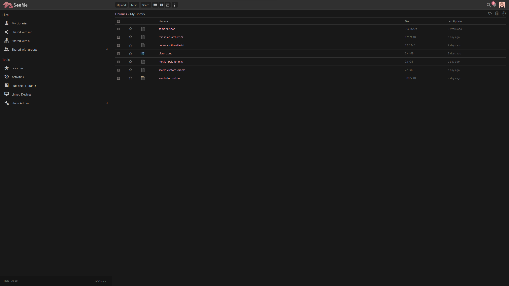
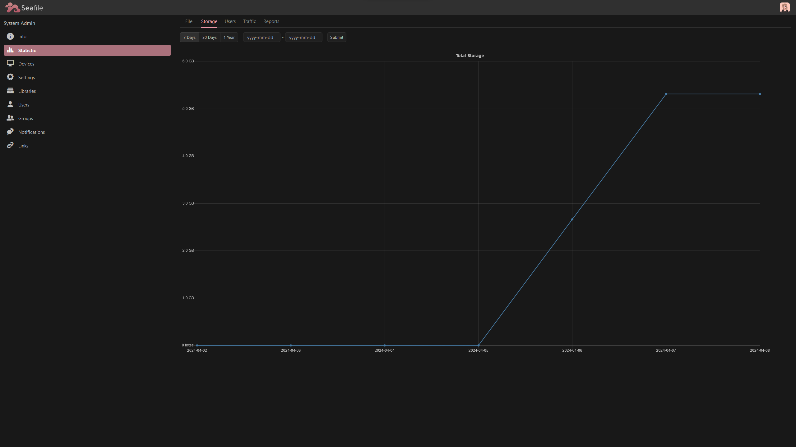
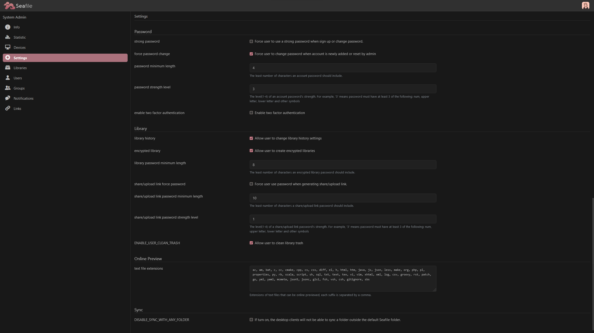

# seafile-custom-css
My (incomplete) custom CSS for Seafile, made to be easy on the eyes and slightly softer than the default styling.

### How do I use this?
On your Seafile admin settings page, paste this into your Custom CSS textbox:
```
@import url('https://frugbug.github.io/seafile-custom-css/seafile.css');
```

### What does it look like?
  

  

  

  

### Why is there a website?
Because if I simply put the file from `raw.githubusercontent.com` into Seafile's custom CSS field, it won't work. Github serves all text files with a MIME type of `text/plain` to prevent people abusing their service as a CDN, which is a shame, because that would be really cool. So in order to have the CSS file hosted here (and also have it work), it needs to be part of a Github pages site.

### Why is there a shell script?
I use Python's `http.server` module to host this for my Seafile instance when I work on it, so I don't have to commit each small change I make.
